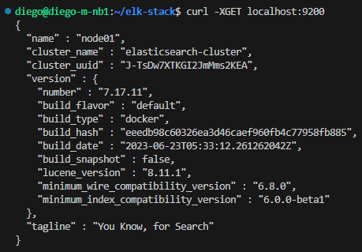
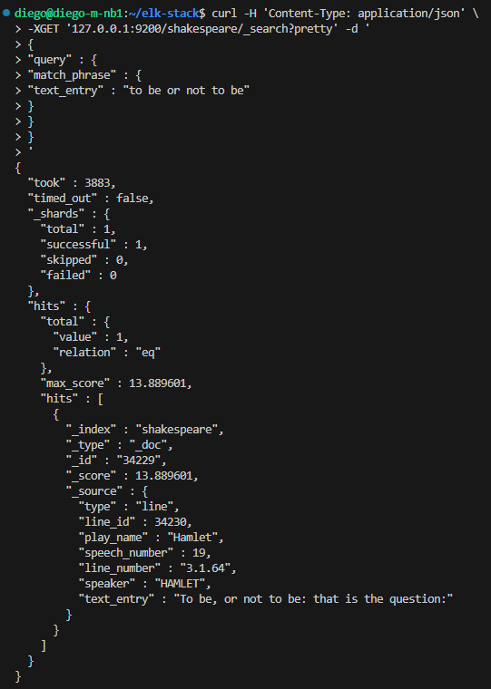

# Elastic Stack

"ELK é o acrônimo para três projetos open source: Elasticsearch, Logstash e Kibana. O Elasticsearch é um mecanismo de busca e análise. O Logstash é um pipeline de processamento de dados do lado do servidor que faz a ingestão de dados a partir de inúmeras fontes simultaneamente, transforma-os e envia-os para um "esconderijo" como o Elasticsearch. O Kibana permite que os usuários visualizem dados com diagramas e gráficos no Elasticsearch."

* [Tópicos](#topicos)
    - [Elasticsearch](#elasticsearch)

## Elasticsearch
### Iniciando Elasticsearch:
 
    $ docker-compose up -d elasticsearch
    $ curl -XGET localhost:9200

### Testando Elasticsearch:
Criando index:

    $ wget http://media.sundog-soft.com/es7/shakes-mapping.json
    $ curl -H 'Content-Type: application/json' \
    -XPUT 127.0.0.1:9200/shakespeare \
    --data-binary @shakes-mapping.json
    $ wget http://media.sundog-soft.com/es7/shakespeare_7.0.json
    $ curl -H 'Content-Type: application/json' \
    -XPOST '127.0.0.1:9200/shakespeare/_bulk?pretty' \
    --data-binary @shakespeare_7.0.json

Realizando uma consulta:

    $ curl -H 'Content-Type: application/json' \
    -XGET '127.0.0.1:9200/shakespeare/_search?pretty' -d '
    {
    "query" : {
    "match_phrase" : {
    "text_entry" : "to be or not to be"
    }
    }
    }
    '

